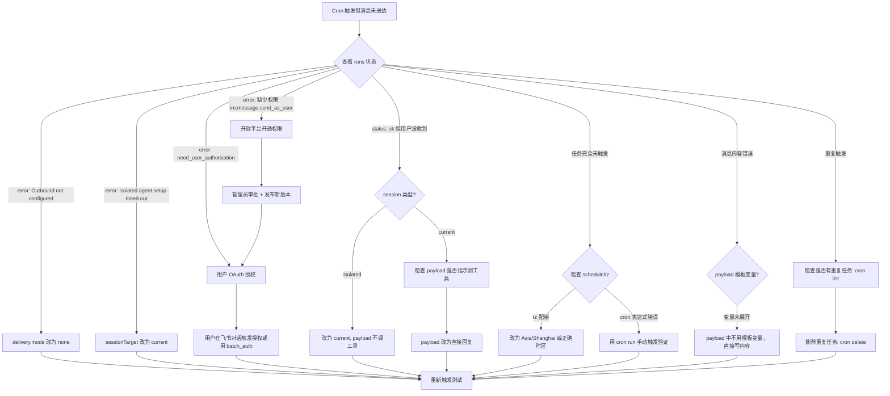

# 飞书 Cron 定时任务

用于创建和排查飞书方向的 Cron 定时推送任务（提醒、通知、汇报等）。

## 创建任务

**核心原则：用 `sessionTarget: "current"` + `delivery.mode: "none"` + payload 直接回复。**

正确配置模板：

```json
{
  "name": "任务名称",
  "schedule": {
    "kind": "cron",
    "expr": "0 9 * * 1-5",
    "tz": "Asia/Shanghai"
  },
  "sessionTarget": "current",
  "payload": {
    "kind": "agentTurn",
    "message": "直接写出要让用户看到的内容。不需要调用任何工具。"
  },
  "delivery": {
    "mode": "none"
  }
}
```

**为什么这样配：**

- `sessionTarget: "current"` — 绑定飞书 DM session，agent 回复自动通过飞书通道投递
- `delivery.mode: "none"` — 不走 cron 系统的 outbound 投递（openclaw-lark 插件环境没有 feishu outbound 路由）
- payload 只写内容 — 不需要让 agent 调用 `feishu_im_user_message` 等工具

## 排障决策树

Cron 任务触发后消息未送达时，按以下顺序排查：



## 日常运维操作

### 列出所有任务
```bash
cron list
```

### 查看任务详情
```bash
cron get <task-id>
```

### 手动触发测试
```bash
cron run <task-id>
```

### 修改任务
```bash
cron update <task-id> --schedule '0 10 * * 1-5' --payload '新的消息内容'
```

### 暂停/恢复任务
```bash
cron pause <task-id>
cron resume <task-id>
```

### 删除任务
```bash
cron delete <task-id>
```

## Cron 表达式速查表

| 用户说法 | Cron 表达式 | 含义 |
|---------|------------|------|
| 每天早上9点 | `0 9 * * *` | 每天 09:00 |
| 每个工作日早上9点 | `0 9 * * 1-5` | 周一至周五 09:00 |
| 每小时提醒一次 | `0 * * * *` | 每小时整点 |
| 每30分钟 | `*/30 * * * *` | 每30分钟 |
| 每天中午12点 | `0 12 * * *` | 每天 12:00 |
| 每周一早上10点 | `0 10 * * 1` | 每周一 10:00 |
| 每月1号早上9点 | `0 9 1 * *` | 每月1日 09:00 |
| 早上9点和下午2点 | `0 9,14 * * *` | 每天 09:00 和 14:00 |
| 工作日早中晚各一次 | `0 9,12,18 * * 1-5` | 周一至周五 09/12/18:00 |

**格式说明：** `分 时 日 月 周`
- `*` = 每个单位
- `1-5` = 范围（1到5）
- `*/30` = 每30单位
- `9,14` = 列举（9和14）
- 时区必须显式指定：`"tz": "Asia/Shanghai"`

## 常见错误速查

| 报错 | 原因 | 修复 |
|------|------|------|
| `Outbound not configured for channel: feishu` | openclaw-lark 插件无标准 outbound 路由 | `delivery.mode` → `"none"` |
| `应用缺少权限 [im:message.send_as_user]` | 飞书应用未开通该权限 | 开放平台开通 + 发布新版本 |
| `need_user_authorization` | 用户未 OAuth 授权给应用 | 飞书对话触发授权 / `feishu_oauth_batch_auth` |
| `isolated agent setup timed out` | isolated session 启动超时 | `sessionTarget` → `"current"` |
| status: ok 但用户没收到 | isolated session 无 OAuth token / payload 让 agent 调工具 | 改 current + payload 直接回复 |

## 关键认知

1. **管理员审批 ≠ 用户 OAuth 授权。** 飞书用户身份 API 需要用户本人授权，两步缺一不可。
2. **Isolated session 不继承用户 OAuth token。** 需要用户身份的操作不能放 isolated session。
3. **Payload 设计匹配 session 类型。** current session 里"直接回复"即可；不要在 current 里还让 agent 调消息发送工具。
4. **不要用 `delivery.mode: "announce"`。** openclaw-lark 环境没有 feishu outbound 路由，announce 必失败。

## 验证步骤

创建或修复后，用 `cron run` 手动触发一次，检查：

1. `cron runs` 中 status 是否为 `ok`
2. 用户是否在飞书 DM 中收到消息
3. 消息内容是否符合预期

两者都满足才算通。
